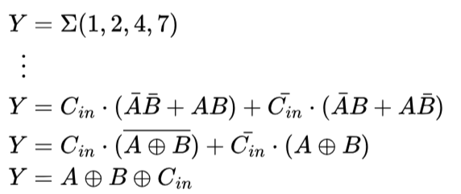
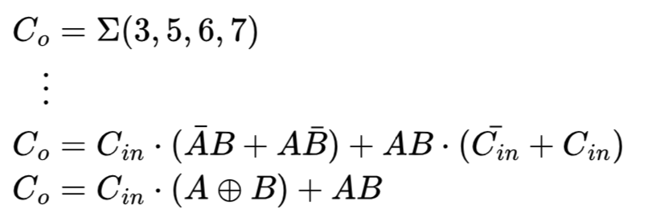
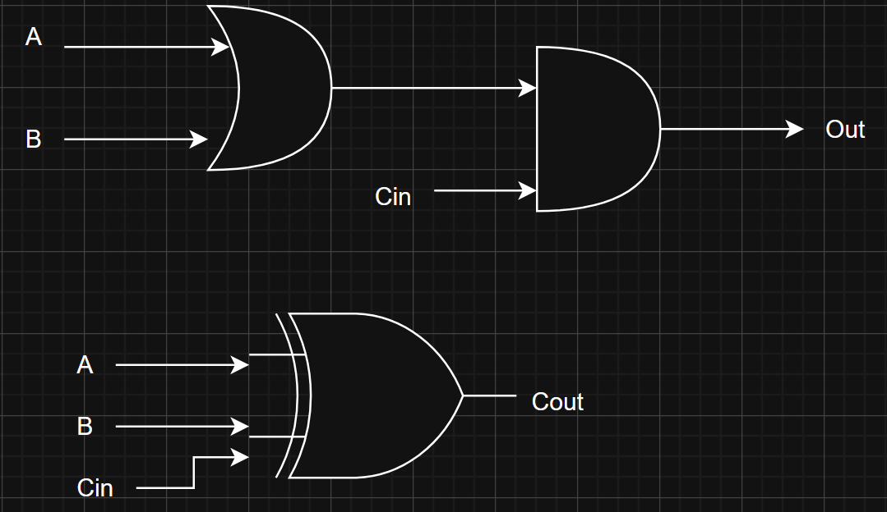
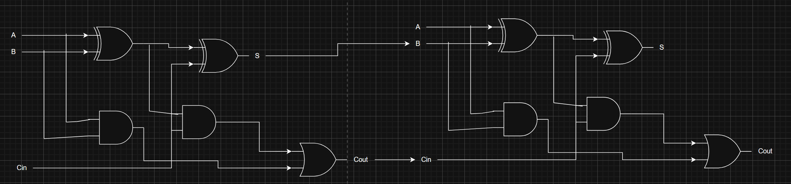
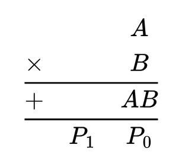
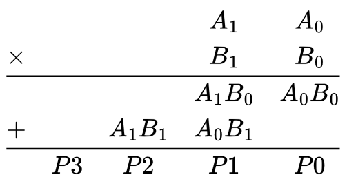
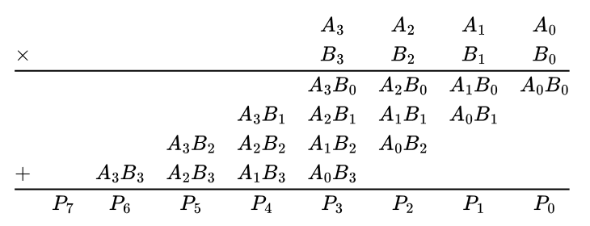
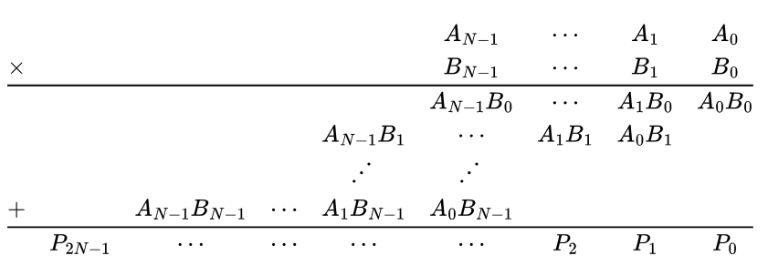

# Problema 1

## Propuesta 1

Operaciones a implementar manualmente:
- Suma
- Resta
- Multiplicación

### Suma

Para el diseño de la suma se toma como base la lógica detrás de un full adder de 1 bit el cual dispone de 3 entradas $A, B, C_{in}$ y dos salidas $Y, C_o$. Las primeras dos entradas representan los sumandos y la tercera representa una entrada adicional para considerar el acarreo de una suma previa si lo hubiese. La salida $Y$ representa el resultado de la suma y $C_o$ el acarreo que debe tomarse en cuenta para el siguiente dígito.

El comportamiento esperado para un full adder de un bit se muestra en la siguiente tabla de verdad:

| $A$ | $B$ | $C_{in}$ | $Y$ | $C_{out}$ |
|-|-|-|-|-|
| 0 | 0 | 0 | 0 | 0 |
| 0 | 0 | 1 | 1 | 0 |
| 0 | 1 | 0 | 1 | 0 |
| 0 | 1 | 1 | 0 | 1 |
| 1 | 0 | 0 | 1 | 0 |
| 1 | 0 | 1 | 0 | 1 |
| 1 | 1 | 0 | 0 | 1 |
| 1 | 1 | 1 | 1 | 1 |

Con base a la tabla de verdad pueden obtenerse las ecuaciones para cada salida de forma que:

Para $Y$, usando suma de productos:
<!---
\begin{align*}
Y &= \Sigma(1,2,4,7)\\
\vdots\\
Y &= C_{in}\cdot(\bar{A}\bar{B}+AB)+\bar{C_{in}}\cdot(\bar{A}B+A\bar{B})\\
Y &= C_{in}\cdot(\overline{A \oplus B}) + \bar{C_{in}}\cdot(A \oplus B)\\
Y &= A \oplus B \oplus C_{in} 
\end{align*}
--->

Para $C_o$, usando suma de productos:
<!---
\begin{align*}
C_{o} &= \Sigma(3,5,6,7)\\
\vdots\\
C_{o} &= C_{in}\cdot(\bar{A}B + A\bar{B}) + AB\cdot(\bar{C_{in}}+C_{in})\\
C_{o} &= C_{in}\cdot(A \oplus B) + AB\\
\end{align*}
--->

Para extender la suma a $N$-bits basta con colocar $N$ full adders de un bit en cascada conectando adecuadamente las salidas $C_{o}$ con las entradas $C_{in}$.

### Resta 

Para el diseño de la resta se parte del concepto matemático de la misma, utilizando una tabla de verdad de 4 bits se ejecuta la resta de $A - B$. Sin embargo, al realizar la operación 0 - 1 naturalmente quedaría un resultado negativo, pero en el sistema binario solamente se pueden usar 0 y 1. Por lo tanto, para representar un resultado negativo se utiliza un bit de acarreo de salida ($C_{out}$) el cual se activa si la resta es menor a 0. Adicional a esto, se debe utilizar un bit de acarreo de entrada ($C_{in}$) el cual se activa si el bit de acarreo anterior estaba activo. De esta manera se puede representar el comportamiento de la resta respetando sus respectivos acarreos y en caso de que el ultimo bit de acarreo esté activo esto activaría la flag de negativo, mostrando así que el resultado de la resta es menor que 0. Al realizar las restas con su respectivo bit de acarreo se obtiene la siguiente tabla de verdad la cual se puede resumir en el diagrama de compuertas que se muestran posteriormente.

| $C_{in}$ | $A$ | $B$ | $C_{out}$ | $R$ |
|---|---|---|-------|-------|
| 0 | 0 | 0 |   0   |   0   | 
| 0 | 0 | 1 |   1   |   0   | 
| 1 | 1 | 0 |   1   |   1   |  
| 1 | 1 | 1 |   0   |   1   | 

### Multiplicación
Para el caso de la multiplicación se parte de la definición de la misma, la cual establece que la multiplicación es la suma repetida de un mismo número. Por lo tanto se aprovecha el modulo de suma implementado previamente para usarla en cascada un numero determinado de veces, tomando el resultado de la suma anterior como el sumando "A" y el sumando "B" es el numero original. En el siguiente diagrama se muestra el funcionamiento con una cascada, este proceso se repite "n" veces según sea el caso.

## Propuesta 2

Operaciones a implementar manualmente:
- Suma
- Resta
- Multiplicación

### Suma

### Resta

Para implementar un restador completo parametrizable se parte de la idea de que una resta puede realizarse como una suma en complemento a dos: $A - B = A + (\overline{B} + 1)$.

1. **Inversión de B:** Se aplica un inversor bit a bit a la entrada B para obtener $\bar{B}$.
2. **Suma de +1:** Se utiliza un adder para calcular $\bar{B} + 1$, generando así el complemento la base disminuida de $\bar{B}$.
3. **Suma final:** Se conecta otro adder que recibe como entradas $A$ y $(\bar{B} + 1)$. El resultado corresponde a la operación $A - B$.

Finalmente, para obtener el restador completo se conectan los bloques descritos en cascada, asegurando que las señales de acarreo se propaguen correctamente. El resultado de la operación se entrega en una salida `R[N-1:0]`, y se incluye la señal de **carry** y **overflow** para las flags solicitadas.

En este diseño se aplica exitosamente el modelado estructural al tener adders e inversores como modulos separados que en conjunto llevan a cabo una resta.

### Multiplicación

Para la multiplicación se parte de forma general de una multiplicación de dos entradas de un bit. Dada por:

<!---
\begin{matrix}
 & & A \\
 \times & & B\\\hline
 + & & AB \\\hline
 & P_1& P_0
\end{matrix}
--->

Escalando a dos bits y cuatro bits se obtiene respectivamente:

<!---
\begin{matrix}
 &  &  & A_1& A_0 \\
 \times&  &  & B_1& B_0  \\
\hline
 &  &  & A_1B_0& A_0B_0  \\
+&  &  A_1B_1& A_0B_1&  \\
\hline
 & P3& P2& P1& P0  
\end{matrix}
--->

<!---
\begin{matrix}
 &  &  &  &  &  A_3&  A_2&  A_1& A_0 \\
\times&  &  &  &  &  B_3&  B_2&  B_1& B_0  \\
\hline
 &  &  &  &  &  A_3B_0& A_2B_0& A_1B_0 & A_0B_0 \\
 & & & & A_3B_1& A_2B_1& A_1B_1& A_0B_1 \\
 & & & A_3B_2& A_2B_2& A_1B_2& A_0B_2 \\
 +& & A_3B_3& A_2B_3& A_1B_3& A_0B_3 \\
\hline
 & P_7&  P_6&  P_5&  P_4&  P_3&  P_2&  P_1& P_0 
\end{matrix}
--->

Con esto puede observarse que existe un patrón en el que, partiendo de dos entradas de $N$ bits dadas por $(A_{N-1},\dots,A_{1},A_{0})$, $(B_{N-1},\dots,B_{1},B_{0})$, el producto $P$ consiste de una salida dada por $(P_{2N-1},\dots,P_1,P_0)$ que tiene la siguiente estructura:

<!---
\def\rddots{{{{{{.^{\Large.^{\LARGE.^{}}}}}}}}}
\begin{matrix}
 &  &  &  &  &  A_{N-1}&  \cdots&  A_1& A_0 \\
\times&  &  &  &  &  B_{N-1}&  \cdots&  B_1& B_0  \\
\hline
 &  &  &  &  &  A_{N-1}B_0& \cdots& A_1B_0 & A_0B_0 \\
 & & & & A_{N-1}B_1& \cdots& A_1B_1& A_0B_1 \\
 & & & & \rddots& \rddots& & \\
 +& & A_{N-1}B_{N-1}& \cdots& A_1B_{N-1}& A_0B_{N-1} \\
\hline
 & P_{2N-1}&  \cdots&  \cdots&  \cdots&  \cdots&  P_2&  P_1& P_0 
\end{matrix}
--->

Esta multiplicación se fundamenta en productos parciales que no son más que la operación AND aplicada entre el multiplicando ($A$) y cada uno de los bits del multiplicador ($B$). Luego, para asegurar una adecuada suma (y por tanto, adecuado resultado), por medio de logic shifts que agreguen ceros a la derecha se obtiene garantía de que la suma de los productos parciales llevará a un resultado final $P$ correcto. En tal caso solo es necesario tener precauciones con la relación de significancia entre los bits para que cada dígito sea sumado correctamente con quien corresponda.

Esta propuesta responde al modelo de diseño estructural al representar el producto como una operación compuesta por compuertas AND y sumadores.