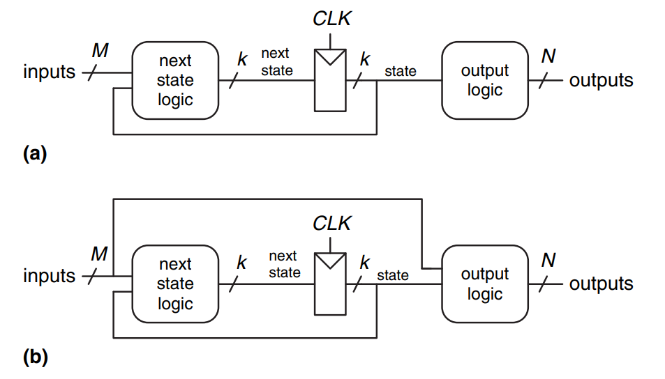

# Investigación

1) Investigue sobre el funcionamiento de máquinas de estado finitos. Explique la diferencia entre una máquina de Moore y una de Mealy y muestre la diferencia por medio de diagramas de estados y señales.

    Las FSM corresponden a una forma de dibujar circuitos secuenciales síncronos que describen el comportamiento de los mismos. Tienen $M$ entradas, $N$ salidas y $k$ registros de estado. Reciben una señal de reloj y una señal de reset opcional.

    En las maquinas de Moore, las salidas dependen únicamente del estado actual de la máquina. En las máquina de Mealy, las salidas dependen tanto del estado como de las entradas actuales.

    

    <!---
    Ref: Harris & Harris 3.4
    --->
    

2) Explique los conceptos de *setup time* y *hold time*. ¿Qué importancia tienen el diseño de sistemas digitales?

    El tiempo de apertura corresponde al tiempo por el cual la entrada debe permanecer estable para que sea registrada adecuadamente con un valor lógico valido. Este tiempo es la suma del *setup time* y el *hold time* los cuales corresponden al tiempo en que la señal debe permanecer estable antes y después del flanco de reloj respectivamente. Estos conceptos son fundamentales en el diseño de sistemas al ser quienes determinan los retardos máximos y mínimos de la lógica combinacional entre flip-flops, los cuales, a su vez, terminan por influir en factores tan importantes como la frecuencia de operación.

    <!---
    Ref: Harris & Harris 3.5
    --->

3) Investigue sobre el efecto de rebote en señales digitales provenientes de elementos mecánicos (interruptores, por ejemplo). Muestre al menos dos formas de solucionar el efecto de rebote, por medio de circuitos digitales.

4) Investigue sobre las señales involucradas en la sincronización de una interfaz VGA.

5) Muestre un diagrama de tiempos de la señales de sincronización de VGA para una resolución de 640x480 pixeles.

6) Para la resolución del punto anterior, calcule matemáticamente la frecuencia aproximada para las señales de sincronización vertical y horizontal.

7) Proponga un diagrama de bloques que implemente el controlador de VGA. Tenga en cuenta que este será parte de su diseño final, utilizando un modelado de estructura.