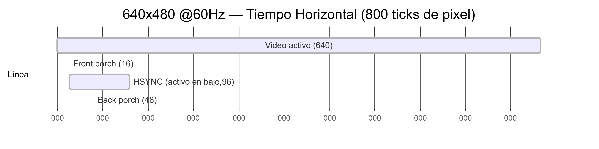
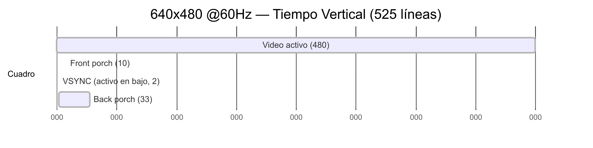
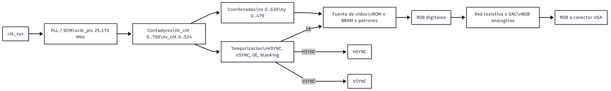

# Investigación

1) Investigue sobre el funcionamiento de máquinas de estado finitos. Explique la diferencia entre una máquina de Moore y una de Mealy y muestre la diferencia por medio de diagramas de estados y señales.

    Las FSM corresponden a una forma de dibujar circuitos secuenciales síncronos que describen el comportamiento de los mismos. Tienen $M$ entradas, $N$ salidas y $k$ registros de estado. Reciben una señal de reloj y una señal de reset opcional.

    En las maquinas de Moore, las salidas dependen únicamente del estado actual de la máquina. En las máquina de Mealy, las salidas dependen tanto del estado como de las entradas actuales.

    

    <!---
    Ref: Harris & Harris 3.4
    --->
    

2) Explique los conceptos de *setup time* y *hold time*. ¿Qué importancia tienen el diseño de sistemas digitales?

    El tiempo de apertura corresponde al tiempo por el cual la entrada debe permanecer estable para que sea registrada adecuadamente con un valor lógico valido. Este tiempo es la suma del *setup time* y el *hold time* los cuales corresponden al tiempo en que la señal debe permanecer estable antes y después del flanco de reloj respectivamente. Estos conceptos son fundamentales en el diseño de sistemas al ser quienes determinan los retardos máximos y mínimos de la lógica combinacional entre flip-flops, los cuales, a su vez, terminan por influir en factores tan importantes como la frecuencia de operación.

    <!---
    Ref: Harris & Harris 3.5
    --->

3) Investigue sobre el efecto de rebote en señales digitales provenientes de elementos mecánicos (interruptores, por ejemplo). Muestre al menos dos formas de solucionar el efecto de rebote, por medio de circuitos digitales.

Definición: Al accionar un interruptor mecánico, los contactos rebotan durante decenas o cientos de microsegundos, generando múltiples transiciones espurias que un sistema digital puede interpretar como varios pulsos. Por ello es necesario “des-rebotar” (debounce) la señal antes de usarla. 

Solución A — Sincronizador + contador (filtro por estabilidad temporal). La entrada asíncrona se sincroniza con dos flip-flops al reloj del sistema y, si el valor sincronizado difiere del valor filtrado, se inicia un contador. Solo cuando la señal permanece estable N ciclos (p. ej., que equivalen a 10–20 ms), se acepta el nuevo estado y se pone a cero el contador. Este método es 100 % digital, parametrizable y muy utilizado en FPGA/ASIC. 
TI

Solución B — Latch RS con conmutador SPDT (debounce por topología digital). Con un SPDT (común y dos contactos) y un biestable RS, el cursor conecta siempre una rama mientras desconecta la otra; los rebotes no producen múltiples transiciones válidas porque el latch mantiene el estado hasta que el contacto cambia de carril de forma estable. Es robusto y completamente digital (reconocido en notas técnicas sobre debounce). 
DigiKey

4) Investigue sobre las señales involucradas en la sincronización de una interfaz VGA.

Una interfaz VGA emplea: R, G y B (señales analógicas de video), HSYNC (sincronía horizontal) y VSYNC (sincronía vertical), además de periodos de blanking con front porch y back porch que rodean los pulsos de sincronía. En el modo 640×480 @≈60 Hz, la polaridad de HSYNC y VSYNC es negativa (activos en bajo) y el pixel clock de referencia es 25.175 MHz. 

5) Muestre un diagrama de tiempos de la señales de sincronización de VGA para una resolución de 640x480 pixeles.

6) Para la resolución del punto anterior, calcule matemáticamente la frecuencia aproximada para las señales de sincronización vertical y horizontal.

Frecuencia horizontal:
f_H = f_pix / H
f_H = 25.175e6 / 800
f_H = 31,468.75 Hz  ≈ 31.469 kHz

Frecuencia vertical:
f_V = f_H / V
f_V = 31,468.75 / 525
f_V ≈ 59.94 Hz

7) Proponga un diagrama de bloques que implemente el controlador de VGA. Tenga en cuenta que este será parte de su diseño final, utilizando un modelado de estructura.

