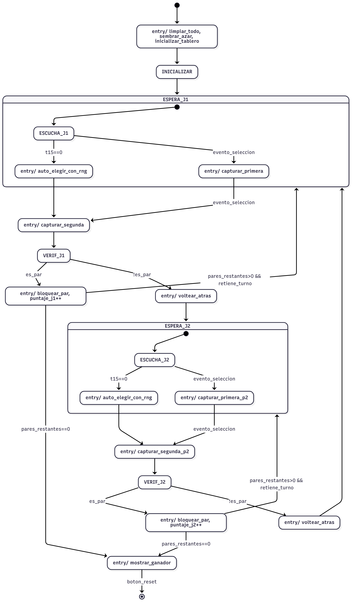
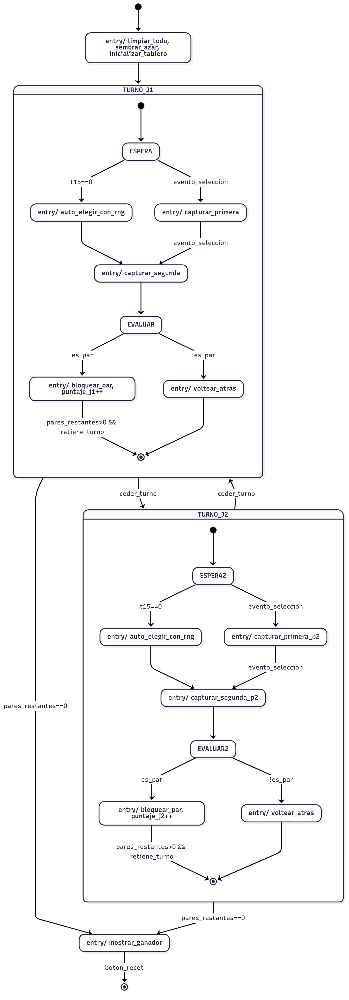

# Propuestas de Diseño

## Propuesta 1

Para esta solución se plantea una FSM única de Moore que centraliza el control del sistema. La FSM gestiona las etapas principales: inicialización, manejo de turno del Jugador 1, manejo de turno del Jugador 2 y fin de juego. Dentro de cada turno, la FSM coordina de forma secuencial: arranque y supervisión del temporizador, captura de la primera selección, captura de la segunda selección, verificación de coincidencia y resolución (bloqueo de cartas y actualización de puntaje en caso de acierto; restauración y cambio de turno en caso contrario). Ante expiración del temporizador, ordena una selección automática para mantener la progresión del juego.

Interfaces y evaluación: La FSM hace el envío de señales de control de estado estable a módulos externos (temporizador de 15 s, generador aleatorio, memoria/estado de cartas, comparador de pareja, contadores de puntaje, visualización). 

## Propuesta 2

Para esta solución se plantea una estructura jerárquica con una FSM maestra de tipo Moore que controla las fases globales (inicialización, turno del Jugador 1, turno del Jugador 2, fin de juego) y se usan sub-FSM para la logica de cada turno. Cada sub-FSM de turno ejecuta un ciclo compacto: activación y lectura del temporizador, toma de primera y segunda elección, verificación de coincidencia y resolución. La sub-FSM notifica a la FSM superior el estado del turno y la superior determina el siguiente macroestado.

Interfaces y evaluación. El nivel de separación aclara la responsabilidad y reduce el número de cada controlador, lo cual permite legibilidad, pruebas unitarias y extensión (por ejemplo, agregar animaciones o revelados sin alterar la lógica global). Las salidas visibles todavía están ligadas a estados Moore en la capa superior, con estabilidad, mientras las sub-FSMs pueden generar pulsos puntual para acciones atómicas (captura, bloqueo, volteo). 

